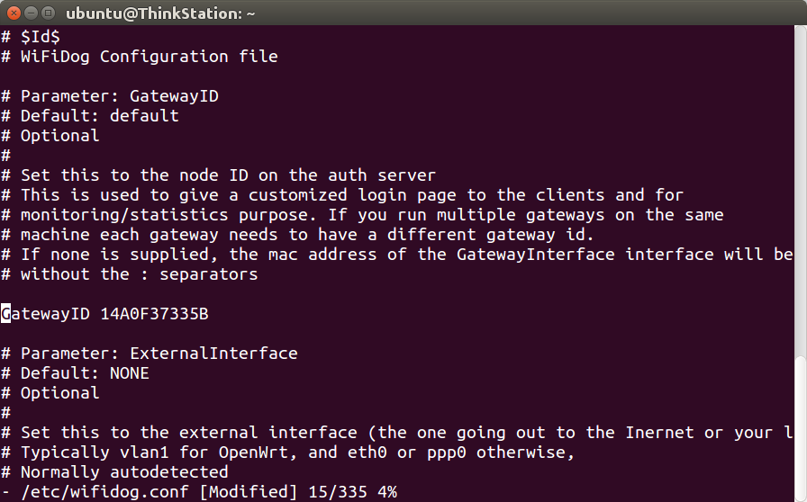
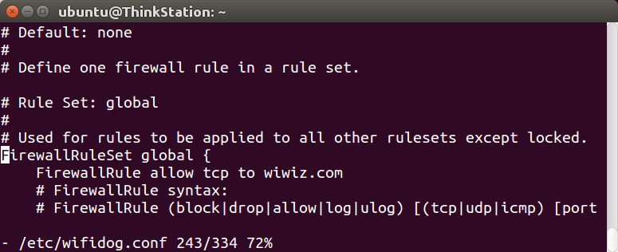

# 编译一个包 How to Build a Single Package

## 准备编译环境 prerequisites

OpenWrt是Linux，所以使用Linux系统进行开发很方便。本文档使用Ubuntu系统（官网：[ubuntu.com](http://www.ubuntu.com/download/desktop)，国内镜像下载：[mirrors.aliyun.com](http://mirrors.aliyun.com/ubuntu-releases/15.04/)），建议使用最新稳定版15.04 Desktop 64-bit或者14.04 Server 64-bit。如果用的是Windows或OSX，可以用免费的虚拟机Virtual Box\([virtualbox.org](https://www.virtualbox.org/)\)安装Ubuntu。

在Ubuntu系统中执行下列命令，安装依赖：

```
sudo apt-get install subversion build-essential libncurses5-dev zlib1g-dev gawk git ccache gettext libssl-dev xsltproc flex liblzma-dev u-boot-tools
```

## 下载OpenWrt SDK

如果路由器厂商提供了专用的OpenWrt SDK，那是最好的，优先使用。有这些厂商提供了：

极路由`hc5761-20140619.tar.gz`官方下载：

[https://code.hiwifi.com/wiki/hiwifi/sdk-howto](https://code.hiwifi.com/wiki/hiwifi/sdk-howto)

魔豆`openwrt-2.6.36.tar.bz2`和`buildroot-mipsel.tar.bz2`官方下载：

[http://bbs.modouwifi.cn/thread-8261-1-1.html](http://bbs.modouwifi.cn/thread-8261-1-1.html)

如果下载链接已失效，请向厂商反馈。或者在本站进行挖掘（[downloads.openwrt.io](http://downloads.openwrt.io/)），因为本站已经把它们都下载下来了。

不过由于魔豆根目录不可写，ipk无法安装，有SDK也没法用。

本文档继续以极路由为例，下载解压缩到`~/openwrt/hc5761`。

```
mkdir ~/openwrt/
cd ~/openwrt/
tar -zxvf ~/Downloads/hc5761-20140619.tar.gz -C ./
```

## 下载包代码并编译 compile package

以wifidog为例，由于极路由软件源中的wifidog版本太旧，所以需要自己下载编译新版。

下载：

```
cd ~/openwrt/
git clone git@git.coding.net:openwrtio/packages.git
ln -s ~/openwrt/packages/net/wifidog ~/openwrt/hc5761/package/
```

进行菜单配置，选中wifidog这个包（在Network-\>Cative Portals中）：

```
cd ~/openwrt/hc5761
make menuconfig
```


编译：

```
make package/wifidog/compile V=99
```


可以看到编译的结果是一个ipk文件，在bin目录中。把它上传到路由器中，尝试安装。

```
scp bin/ralink/packages/wifidog\_1.2.1-1\_ralink.ipk root@192.168.199.1:/tmp/
ssh root@192.168.199.1
opkg install /tmp/wifidog\_1.2.1-1\_ralink.ipk
/etc/init.d/wifidog start
```

## 启动软件 start package

尝试启动wifidog，将会报错：AuthServer is not set，然后退出。如图所示：

```
/etc/init.d/wifidog start
```


这是由于wifidog尚未配置，打开`/etc/wifidog.conf`，定位到13行，修改GatewayID；定位到62行，删掉行首的井号注释，修改AuthServer；定位到159行，修改FirewallRuleSet global，内容如下：

```
GatewayID 14A0F37335B

AuthServer {         
    Hostname cp.wiwiz.com
    SSLAvailable no           
    Path /as/s/
}

FirewallRuleSet global {
    FirewallRule allow tcp to wiwiz.com
}
```

如图所示：





然后启动wifidog，手机连上此wifi，访问任何网站都会跳转到认证页面，点击“立即开始使用此网络”，即可上网。如图所示：

```
/etc/init.d/wifidog start
```


<!-- 多说评论框 start -->
<div class="ds-thread" data-thread-key="docs-build-a-single-package" data-title="编译package" data-url="http://openwrt.io/docs/build-a-single-package/"></div>
<!-- 多说评论框 end -->
