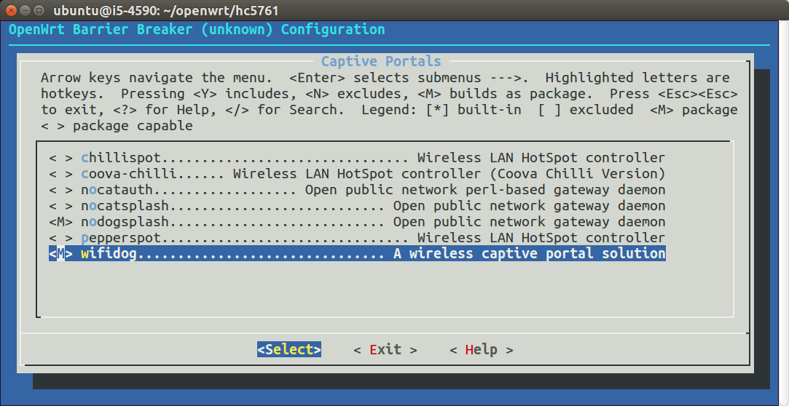

# 编译一个package

## 编译环境

OpenWrt是Linux，所以使用Linux系统进行开发很方便。本文档使用Ubuntu系统，建议使用15.04 Desktop 64-bit或者14.04 Server 64-bit。如果用的是Windows或OSX，可以用免费的虚拟机Virtual Box\([virtualbox.org](https://www.virtualbox.org/)\)安装Ubuntu。

在Ubuntu系统中执行下列命令，安装依赖：

```
sudo apt-get install subversion build-essential libncurses5-dev zlib1g-dev gawk git ccache gettext libssl-dev xsltproc
```

## 下载OpenWrt SDK

如果路由器厂商提供了专用的OpenWrt SDK，那是最好的，优先使用。有这些厂商提供了：

极路由`hc5761-20140619.tar.gz`官方下载：

[https://code.hiwifi.com/wiki/hiwifi/sdk-howto](https://code.hiwifi.com/wiki/hiwifi/sdk-howto)

魔豆`openwrt-2.6.36.tar.bz2`和`buildroot-mipsel.tar.bz2`官方下载：

[http://bbs.modouwifi.cn/thread-8261-1-1.html](http://bbs.modouwifi.cn/thread-8261-1-1.html)

如果下载链接已失效，请向厂商反馈。或者在本站进行挖掘（[downloads.openwrt.io](http://downloads.openwrt.io/)），因为本站已经把它们都下载下来了。

不过由于魔豆根目录不可写，ipk无法安装，有了SDK也是然并卵。

本文档继续以极路由为例，下载解压缩到`~/openwrt/hc5761`。

```
mkdir ~/openwrt/
cd ~/openwrt/
tar -zxvf ~/Downloads/hc5761-20140619.tar.gz -C ./
```

## 下载并编译package

以wifidog为例，由于极路由软件源中的wifidog版本太旧，所以需要自己下载编译新版。

下载：

```
cd ~/openwrt/
git clone git@git.coding.net:openwrtio/packages.git
ln -s ~/openwrt/packages/net/wifidog ~/openwrt/hc5761/package/
```

进行菜单配置，选中wifidog这个包（在Network-\>Cative Portals中）：

```
cd ~/openwrt/hc5761
make menuconfig
```


编译：

```
make package/wifidog/compile V=99
```


可以看到编译的结果是一个ipk文件，在bin目录中。把它上传到路由器中，尝试安装并运行。

```
scp bin/ralink/packages/wifidog_1.2.1-1_ralink.ipk root@192.168.199.1:/tmp/
ssh root@192.168.199.1
opkg install /tmp/wifidog_1.2.1-1_ralink.ipk
/etc/init.d/wifidog start
```
