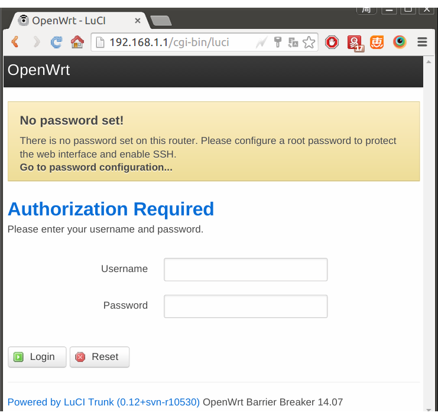
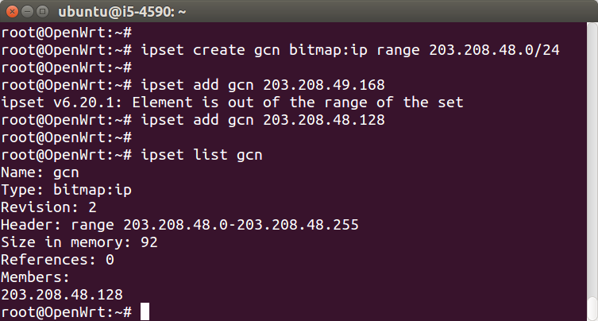

# 刷机

在打造智能VPN路由器的过程中，会发现极路由官方固件不支持ipset，只能做到IP智能分流，无法实现域名智能分流。所以要寻找支持ipset的固件，进行刷机。本文以极路由2为例（极1s新版HC5661A尚没有固件）。

## 下载OpenWrt开源固件

极路由的OpenWrt固件在这里下载：[github.com](https://github.com/rssnsj/openwrt-hc5x61/releases) 或 [本站镜像](http://downloads.openwrt.io/barrier_breaker/14.07/ramips/mt7620a/)，极2的型号为HC5761，所以下载`openwrt-ramips-mt7620a-hiwifi-hc5761-squashfs-sysupgrade.bin`即可。为防止变砖以后无法修复，所以建议先对uboot进行解锁，极2下载`HC5761-uboot.bin`即可。

## 路由器刷入OpenWrt

由于极路由本身已经是OpenWrt了，所以用sysupgrade直接刷机即可。

```
scp ~/Downloads/openwrt-ramips-mt7620a-hiwifi-hc5761-squashfs-sysupgrade.bin root@192.168.199.1:/tmp/
scp ~/Downloads/HC5761-uboot.bin root@192.168.199.1:/tmp/
ssh root@192.168.199.1
cd /tmp
mtd write HC5761-uboot.bin u-boot
sysupgrade -F -n openwrt-ramips-mt7620a-hiwifi-hc5761-squashfs-sysupgrade.bin
```


刷机完毕，shell窗口会卡住，关闭即可。待路由器重启完毕，电脑断开网络重连，即可使用telnet和http管理路由器，会看到下面的画面，需要给root帐号设置密码，然后才可以使用ssh登录。如果刷机失败，路由器无法telnet、http或ssh，则需要刷回官方原厂固件，请按照此文档：[http://openwrt.io/docs/gee/](http://openwrt.io/docs/gee/)

```
telnet 192.168.1.1
passwd
exit
ssh root@192.168.1.1
```




## 测试ipset

刷机是否实现了支持ipset的目的？需要测试，指令如下：

```
ipset create gcn bitmap:ip range 203.208.48.0/24
ipset add gcn 203.208.48.128
ipset list gcn
```



测试通过，实际搭建智能VPN路由器时，是放在dnsmasq里，指令如下：

```
echo "conf-dir=/etc/dnsmasq.d" >> /etc/dnsmasq.conf
mkdir -p /etc/dnsmasq.d
echo -e "server=/fonts.googleapis.com/223.5.5.5\nipset=/fonts.googleapis.com/gcn" > /etc/dnsmasq.d/blacklist
/etc/init.d/dnsmasq restart
```

## 刷回官方原厂固件

各个品牌官网都会提供官方原厂固件，按照型号下载即可。各个品牌刷原厂固件的方式也不同，按照官方文档即可。本站提供这些品牌的固件镜像和刷机文档：

品牌 | 官方原厂固件下载和刷机文档
-----|---------------------------
极路由 | [http://openwrt.io/docs/gee/](http://openwrt.io/docs/gee/)
优酷路由宝 | [http://openwrt.io/docs/youku/](http://openwrt.io/docs/youku/)

<!-- 多说评论框 start -->
<div class="ds-thread" data-thread-key="docs-flashing" data-title="刷机" data-url="http://openwrt.io/docs/flashing/"></div>
<!-- 多说评论框 end -->
